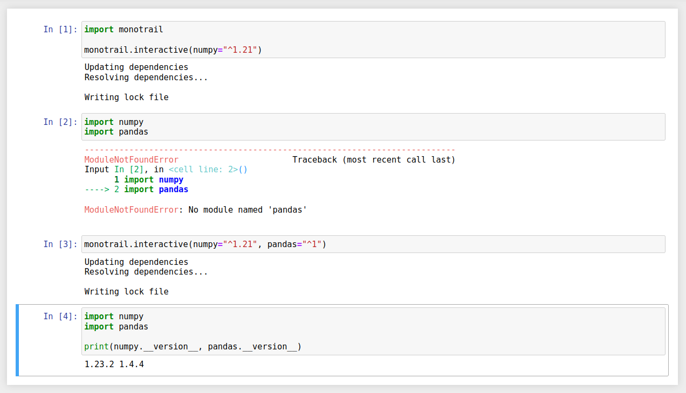
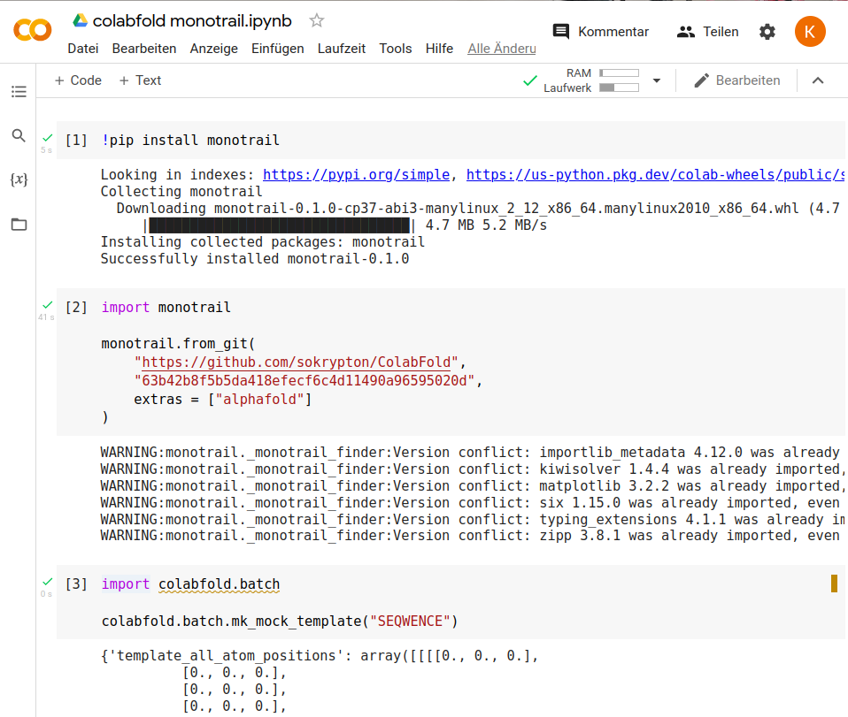

# Proof Of Concept: Monotrail

This proof of concept shows how to use python packages without virtualenvs. It will install both python itself and your dependencies, given a `requirement.txt` or a `pyproject.toml`/`poetry.lock` in the directory.  User the installer from the [latest release](https://github.com/konstin/poc-monotrail/releases/latest), download a binary from [main](https://konstin.github.io/poc-monotrail/) and put it in PATH (e.g. via `.local/bin`) or install with pipx/pipx (`pip install monotrail`):

```
monotrail run python my_script.py
```

Every dependency is installed only once globally and hooked to your code. No venv directory, no explicit installation, no activate, no pyenv.

This is a proof of concept, so only **most features are missing** and will crash or produce nonsense. E.g. non-linux is badly tested, installation is awkward, error messages are suboptimal, only pypi is supported, startup is slow, only some requirement.txt syntax is supported, lockfiles from interactive mode aren't saved, some pkg_resources usage doesn't work, etc. 

monotrail means to show you can use python without the traditional "installing packages in an environment". It also integrates [python-build-standalone](https://github.com/indygreg/python-build-standalone) so you don't need to install python anymore. 

It includes simple reimplementations of pipx and tox. There's also a pip package meant for notebooks, where you can interactively add packages at runtime, get an isolated package set per notebook and avoid version conflicts.

## Usage

Make sure you have either a `requirements.txt` or `pyproject.toml`/`poetry.lock`.

```
monotrail run python my_script.py
```

Picking the python version and extras:

```
monotrail run -p 3.9 --extras fancy-pants python my_script.py --some-option
```

Running commands that used to be in `.venv/bin`:

```
monotrail run command pytest
```

There's also a python package with an entrypoint:

```
pip install monotrail
monotrail_python path/to/your/script.py
```

With jupyter notebooks

```jupyterpython
!pip install monotrail
```

```python
import monotrail

monotrail.interactive(
    numpy="^1.21",
    pandas="^1"
)
```



In google colab, you might want to import your git repository:

```python
import monotrail

monotrail.from_git(
    "https://github.com/sokrypton/ColabFold", "63b42b8f5b5da418efecf6c4d11490a96595020d"
)
```



As [pipx](https://github.com/pypa/pipx) replacement: 

```shell
monotrail ppipx --extras jupyter black .
```

As [tox](https://github.com/tox-dev/tox) replacement:

```shell
monotrail run -p 3.8 -p 3.9 -p 3.10 command pytest
```

You can symlink `monotrail` to a file called `python`, `python3` or `python3.x` and it'll work as python3.8 or the specified python version.

There is also a demo of the flat source layout, where you have the `__init__.py` directly in src instead of nesting `src/srcery/__init__.py`.

```
srcery
├── poetry.lock
├── pyproject.toml
└── src
    ├── __init__.py
    └── potion.py
```

Setting `RUST_LOG=debug` will give you details to track down bugs.

## Background

monotrail first parses which python version you want (3.8 by default) and if not present downloads it from [PyOxy](https://github.com/indygreg/PyOxidizer/tree/main/pyoxy). It doesn't run python as an executable but instead loads `libpython.so` and uses the [C API](https://docs.python.org/3/c-api/veryhigh.html).

Next, we search for a dependencies listing (`poetry.lock` or `requirements.txt`). If required we run poetry to resolve the dependencies (which we bootstrap through a pre-recorded `poetry.lock` for poetry itself). We install all missing packages to separate directories in `.cache/monotrail` and record all locations.

We initialize python and inject a custom [PathFinder](https://docs.python.org/3/library/importlib.html#importlib.machinery.PathFinder) with everything and add it to `sys.meta_path`. When python searches where `import` something from, it goes through all the `Finder`s in `sys.meta_path` until one returns a location. Ours knows the locations of the packages from the lockfile and python doesn't see anything else, so you can only load from the packages matching the lockfile. 

Interactive mode does pretty much the same, except we skip the python installation and there's a check that the version of an already imported package didn't change.

## Benchmarks (wheel installation)

One neat thing about venv-less installation is that we install every package version only once, so no more 3 different installations of pytorch. This takes a lot less disk space (even though clearing the cache is an unsolved problem) but most importantly it means that if you have used all required package versions once before "installation" is instantaneous. It also removes the need to recreate broken venvs.

By reimplementing wheel installation in rust, it also became a good bit faster. `install-wheel-rs` has a separate python interface so you can reuse it as a fast wheel installer on its own.

Installing a single large wheel (plotly)

```
$ virtualenv --clear .venv-benchmark
$ VIRTUAL_ENV=.venv-benchmark hyperfine -p ".venv-benchmark/bin/pip uninstall -y plotly" \
  "target/release/monotrail wheel-install test-data/popular-wheels/plotly-5.5.0-py2.py3-none-any.whl" \
  ".venv-benchmark/bin/pip install --no-deps test-data/popular-wheels/plotly-5.5.0-py2.py3-none-any.whl"
          
Benchmark #1: target/release/monotrail install test-data/popular-wheels/plotly-5.5.0-py2.py3-none-any.whl
  Time (mean ± σ):      5.797 s ±  0.069 s    [User: 3.796 s, System: 1.979 s]
  Range (min … max):    5.699 s …  5.906 s    10 runs
 
Benchmark #2: .venv-benchmark/bin/pip install --no-deps test-data/popular-wheels/plotly-5.5.0-py2.py3-none-any.whl
  Time (mean ± σ):      7.658 s ±  0.061 s    [User: 5.448 s, System: 2.085 s]
  Range (min … max):    7.598 s …  7.758 s    10 runs
 
Summary
  'target/release/monotrail install test-data/popular-wheels/plotly-5.5.0-py2.py3-none-any.whl' ran
    1.32 ± 0.02 times faster than '.venv-benchmark/bin/pip install --no-deps test-data/popular-wheels/plotly-5.5.0-py2.py3-none-any.whl'
```

A sample datascience stack (numpy, pandas, matplotlib)

```
$ ./benchmark.sh 
test-data/poetry/data-science -E tqdm_feature
pip 22.2.2 from /home/konsti/monotrail/.venv-b/lib/python3.8/site-packages/pip (python 3.8)
Poetry (version 1.2.0)
Benchmark 1: .venv/bin/pip install -q -r requirements-benchmark.txt
  Time (mean ± σ):     11.061 s ±  0.179 s    [User: 8.705 s, System: 1.297 s]
  Range (min … max):   10.911 s … 11.258 s    3 runs
 
Benchmark 2: poetry install -q --no-root --only main -E tqdm_feature
  Time (mean ± σ):     16.234 s ±  2.434 s    [User: 42.682 s, System: 4.044 s]
  Range (min … max):   14.037 s … 18.851 s    3 runs
 
Benchmark 3: monotrail poetry-install -E tqdm_feature
  Time (mean ± σ):      5.283 s ±  0.189 s    [User: 13.815 s, System: 2.540 s]
  Range (min … max):    5.085 s …  5.462 s    3 runs
 
Summary
  'monotrail poetry-install -E tqdm_feature' ran
    2.09 ± 0.08 times faster than '.venv/bin/pip install -q -r requirements-benchmark.txt'
    3.07 ± 0.47 times faster than 'poetry install -q --no-root --only main -E tqdm_feature'
```

A mid-sized django project 

```
test-data/poetry/mst -E import-json
pip 22.0.4 from /home/konsti/monotrail/.venv-b/lib/python3.8/site-packages/pip (python 3.8)
Poetry version 1.1.13
Benchmark 1: .venv/bin/pip install -q -r requirements-benchmark.txt
  Time (mean ± σ):     29.481 s ±  0.186 s    [User: 21.001 s, System: 3.313 s]
  Range (min … max):   29.331 s … 29.690 s    3 runs
 
Benchmark 2: poetry install -q --no-root -E import-json
  Time (mean ± σ):     70.291 s ±  1.366 s    [User: 355.966 s, System: 46.958 s]
  Range (min … max):   69.020 s … 71.735 s    3 runs
 
Benchmark 3: monotrail poetry-install -E import-json
  Time (mean ± σ):     10.714 s ±  1.423 s    [User: 43.583 s, System: 10.551 s]
  Range (min … max):    9.504 s … 12.282 s    3 runs
 
Summary
  'monotrail poetry-install -E import-json' ran
    2.75 ± 0.37 times faster than '.venv/bin/pip install -q -r requirements-benchmark.txt'
    6.56 ± 0.88 times faster than 'poetry install -q --no-root -E import-json'
```

## Startup time

Hello world:

```
$ hyperfine --warmup 2 "python hello.py" "../target/release/monotrail run python hello.py"
Benchmark 1: python hello.py
  Time (mean ± σ):      17.3 ms ±   0.8 ms    [User: 14.5 ms, System: 2.9 ms]
  Range (min … max):    16.3 ms …  20.5 ms    159 runs
 
Benchmark 2: ../target/release/monotrail run python hello.py
  Time (mean ± σ):     218.4 ms ±   5.4 ms    [User: 161.6 ms, System: 55.9 ms]
  Range (min … max):   212.0 ms … 232.5 ms    13 runs
 
Summary
  'python hello.py' ran
   12.65 ± 0.64 times faster than '../target/release/monotrail run python hello.py'
```

Simplest numpy usage:

```python
import sys
import numpy
print(
    f"hi from python {sys.version_info.major}.{sys.version_info.minor} and "
    f"numpy {numpy.__version__}"
)
```

```
$ hyperfine --warmup 2 "python numpy_version.py" "../target/release/monotrail run python numpy_version.py"
Benchmark 1: python numpy_version.py
  Time (mean ± σ):      99.8 ms ±   1.2 ms    [User: 127.3 ms, System: 171.7 ms]
  Range (min … max):    98.1 ms … 103.1 ms    29 runs
 
Benchmark 2: ../target/release/monotrail run python numpy_version.py
  Time (mean ± σ):     285.9 ms ±   1.8 ms    [User: 247.6 ms, System: 169.3 ms]
  Range (min … max):   283.4 ms … 289.9 ms    10 runs
 
Summary
  'python numpy_version.py' ran
    2.86 ± 0.04 times faster than '../target/release/monotrail run python numpy_version.py'
```
